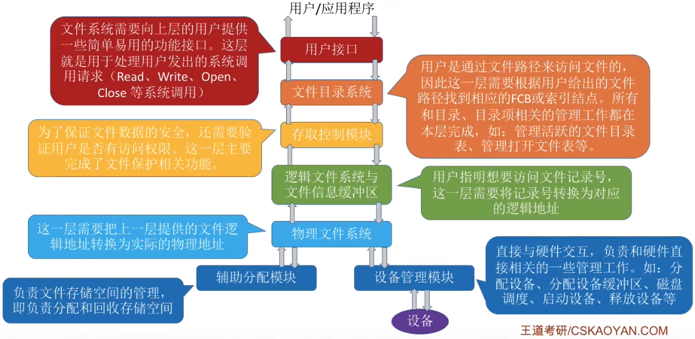
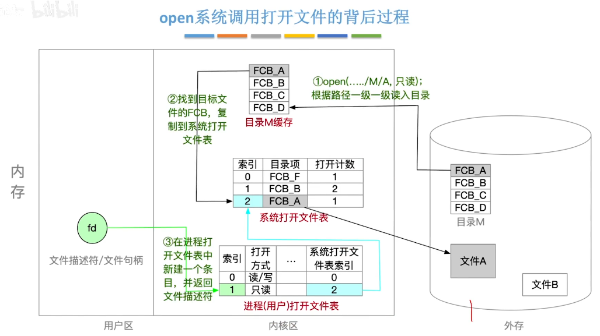

# 文件系统层次结构

## Remind

- 

## 用户接口层

- 提供用户与文件系统交互的接口，处理用户操作请求。直接与用户交互，提供友好的操作界面

## 文件系统接口层

- 提供系统调用接口，处理文件描述符的分配和管理。提供进程与文件系统之间的桥梁

## 逻辑文件系统层

- 管理文件和目录的逻辑结构，维护文件控制块和索引结点。提供文件的抽象视图，隐藏底层物理存储的细节

## 文件组织模块层

- 管理文件的物理存储结构，处理文件的扩展和收缩。负责文件的物理布局和磁盘块的分配与释放

## 基本文件系统层

- 管理磁盘块的读写操作，维护磁盘块缓存，与设备驱动程序交互。负责文件的物理存储和磁盘I/O操作

## 设备驱动程序层

- 直接与硬件设备交互，处理磁盘的物理操作。负责硬件设备的控制和管理

## 物理设备层

- 管理物理存储设备，处理设备的初始化和关闭操作。直接与硬件交互，提供文件系统的最终存储介质

# 文件系统布局

## 文件系统在磁盘中的结构

### Remind

- 

### 主引导记录（MBR，Master Boot Record）

- > 位于磁盘的0号扇区，包含磁盘引导程序和分区表。执行MBR（也就是执行磁盘引导程序）第一件事是确定活动分区，即读入分区的引导块

### 引导块（boot block）

- > ==位于逻辑结构上的第一个块，每个分区都从引导块开始。随后根据分区有无操作系统，启动/不启动分区中的操作系统。再启动文件系统。==MBR根据分区表项中的起始扇区号计算得到物理地址，起始扇区号\*MBR扇区大小=物理地址

### 超级块（super block）

- >包含文件系统的所有关键信息，在计算机启动时，或在该文件系统首次使用时，超级块会被读入内存

- 块的数量

- 块的大小

- 空闲块的数量和指针

- 空闲的FCB数量和指针

- 等等

## 文件系统在内存中的结构

- 

# 文件存储空间管理

## Remind

- 算法可在 [内存的连续分配管理方式.md](..\-003-内存管理\内存的连续分配管理方式.md) 中查看

## 存储空间的划分和初始化

- 文件卷（逻辑卷），目录区、文件区的概念
- 目录区包含文件目录、空闲表、位示图、超级块等用于文件管理的数据

## 空闲表法

- 空闲表中记录每个连续空闲区的起始盘块号、盘块数
- 分配时可采用首次适应、最佳适应等策略；回收时注意表项的合并问题

## 空闲链表法

### 空闲盘块链

- 以盘块为单位组成一条空闲链
- 分配时从链头依次取出空闲块，回收时将空闲块插到尾链

### 空闲盘区链

- 以盘区为单位组成一条空闲链
- 分配时可采用首次适应、最佳适应等策略；回收时注意相邻空闲盘区合并的问题

## 位示图法

- 一个二进制位对应一个盘块。（字号，位号）或（行号，列号）与盘块号一一对应
- 重要考点：要能够自己推出盘块号-\>（字号，位号）之间的相互转换公式
- 需要注意的题目条件
  - 二进制位0/1到底哪个代表空闲，哪个代表不空闲
  - 字号、位号、盘块号到底是从0开始还是从1开始

## 成组链接法

# 虚拟文件系统（VFS）

## 特点

- ==向上层用户进程提供统一标准的系统调用接口，屏蔽底层具体文件系统的实现差异==
- ==向下层要求文件系统必须实现某些规定的函数功能==
- 每代开一个文件，VFS就在主存中新建一个vnode，用==统一的数据结构==表示文件
  - ==vnode只存在与内存中==，而inode（索引结点）存在于内存和外存中
  - 函数功能指针：下层文件系统提供的函数功能

## 文件系统挂载

- 在VFS中注册新挂载的文件系统。==内存中的挂载表==包含每个文件系统的相关信息，包括文件系统类型、容量大小等
- 新挂载的文件系统，要向VFS提供一个==函数地址列表==
- 将文件系统加到==挂载点==，也就是将新文件系统挂载在某个父目录下