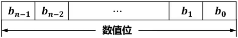
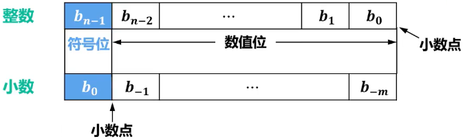
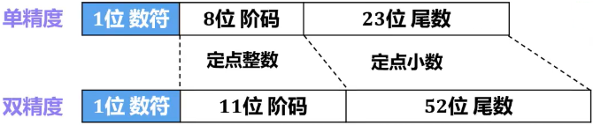

# 概述

- 电子数字计算机内部使用==二进制==来表示数据

# ==计算机内部参与运算的数==

## ==无符号数==

- 
- ==机器数（机器码）==
  ==仅进制转换==

## ==有符号数==

### ==定点数==

#### ==整数==

#### ==小数==

#### Tip

- 
- ==机器数（机器码）==
  ==原码==
  ==补码==
  ==反码==
  ==移码==
  ==（定点小数除外）==

### ==浮点数==

#### ==单精度==

#### ==双精度==

#### Tip

- 
- ==机器数（机器码）==
  ==IEEE 754标准==
  阶码用==移码==
  尾数用==原码==

# ==真值==

- > 人们熟悉的数值