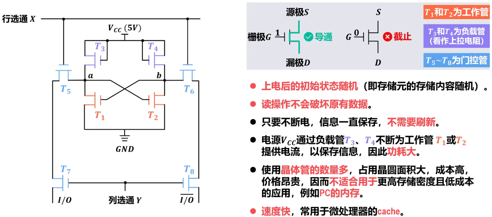
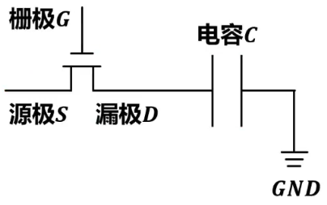

# 随机存取存储器RAM

## Remind

- ==SRAM和DRAM属于易失性存储器==，断电数据就会消失

## 静态随机存取存储器SRAM

### 概述

- 静态随机存取器SRAM（Static Random-Access Memory）是随机存取存储器RAM的一种
  - 所谓“==静态==”，是指这种RAM只要保持通电，其内部所存储的数据就可以保持不变，而==不需要进行周期性地刷新==
- 目前，SRAM内部的存储元（存储1个二进制的单元）一般采用多个金属-氧化物半导体场效应晶体管MOSFET（Metal-Oxide-Semiconductor Field-Effect Transistor）来构建，MOSFET常简称为==MOS管==

### 存储元

#### Remind

- 
- A或B端的电位可以根据导通情况利用电源电压减去导通MOS管电压得到

#### 特点

- ==上电后初始状态随机==
- ==读操作不会破坏原有数据==
- ==不需要刷新==
- 电源驱动大量晶体管，==功耗大==
- 使用==晶体管的数量多==，占用晶圆面积大，成本高。但==速度快==，常用于高速缓存==cache==

### 存储阵列扩展

- 

### 存储器结构

- 

## 动态随机存取存储器DRAM

### 概述

- 数据只能保存较短时间，==需要进行周期性地刷新==

### 存储元

#### Remind

- 

#### 特点

- MOS管不可能完美关断，电容C上的电荷会逐渐泄露，数据只能保存较短的时间。为避免数据丢失，必须采用类似读操作的方式对电容C补充电荷，称为==刷新==，这也是动态RAM（DRAM）得名的原因
- ==读取==一行中某个存储元的信息，将会==破坏==这==一行中所有存储元的信息==，==读操作后==必须立即进行==写操作==

#### 灵敏读出/恢复放大器

- 根据锁存的值，恢复各存储元中电容的原本状态

#### 读写操作流程

1. 预充电操作
2. 访问操作
3. 信号检测
4. 数据恢复
5. 数据输出/输入

### 动态刷新

#### 刷新周期

