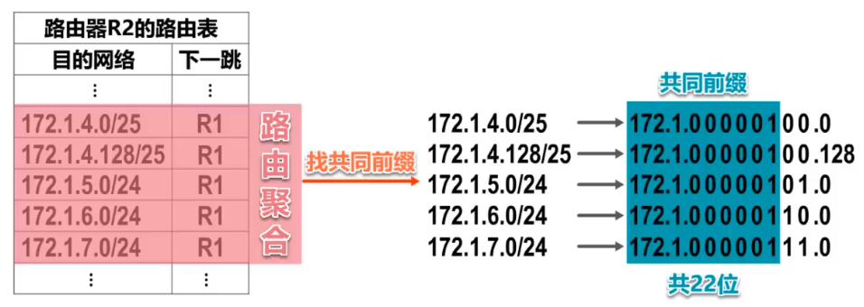
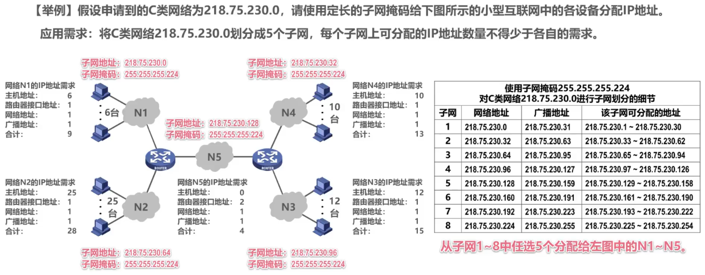
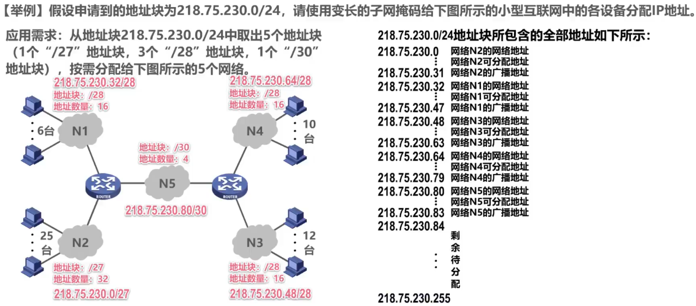

# 概述

- 在TCP/IP体系中，IP地址是一个最基本的概念
- ==IPv4地址==就是给因特网上的==每一台主机（或路由器）的每一个接口==分配一个在全世界范围内是==唯一的32比特的标识符==
- IP地址有因特网名字和数字分配机构ICANN（Internet Corporation for Assigned Names and Numbers）进行分配
  - 我国用户可向亚太网络信息中心APNIC（Asia Pacific Network Information Center）申请IP地址，需要缴费
  - 2011.2.3，互联网号码分配管理局IANA（由ICANN行使职能）宣布，IPv4地址已经分配完毕
  - 我国在2014至2015年也逐步停止了向新用户和应用分配IPv4地址。同时全面开展商用部署IPv6

- ==IPv4地址的编制方法经历的三个历史阶段==

  - | 时间 | 编址方法   |
    | ---- | ---------- |
    | 1981 | 分类编址   |
    | 1985 | 划分子网   |
    | 1993 | 无分类编址 |

- 32比特的IPv4地址不方便阅读、记录以及输入，因此IPv4地址采用==点分十进制表示方法==方便用户使用

# 分类编制的IPv4地址

## Remind

- | 地址类型            | 最高位编码 | 网络号 | 主机号 |
  | ------------------- | ---------- | ------ | ------ |
  | A                   | 0          | 8位    | 24位   |
  | B                   | 10         | 16位   | 16位   |
  | C                   | 110        | 24位   | 8位    |
  | D（多播地址）       | 1110       |        |        |
  | E（保留为今后使用） | 1111       |        |        |

  - 只有A、B和C类地址可分配给网络中的主机或路由器的各接口
  - 主机号为“全0”的地址是网络地址，不能分配给主机或路由器的各接口
  - 主机号为“全1”的地址是广播地址，不能分配给主机或路由器的各接口

## A类地址

- 最小网络号==0==，保留不指派
- 第一个可指派网络号为==1==，网络地址为==1.0.0.0==
- 最大网络号==127==，作为==本地环回测试地址==，不指派
  - 最小本地环回测试地址为==127.0.0.1==（主机号全0是网络地址，不能用）
  - 最大本地环回测试地址为==127.255.255.254==（主机号全1是广播地址，不能用，只能到254）
- 最后一个可指派的网络号为==126==，网络地址为==126.0.0.0==
- 可指派的网络数量为 2^(8-1)^-2=126（除去最小网络号0和最大网络号127）
- 每个网络中可分配的IP地址数量 2^24^-2=16777214（除去网络地址和广播地址）

## B类地址

- 最小网络号是第一个可指派的网络号==128.0==，网络地址为==128.0.0.0==
- 最大网络号是最后一个可指派的网络号==191.255==，网络地址为==191.255.0.0==
- 可指派网络数量为 2^(16-2)^=16384
- 每个网络中可分配的IP地址数量为2^16^-2=65534（除去网络地址和广播地址）

## C类地址

- 最小网络号是第一个可指派的网络号==192.0.0==，网络地址为==192.0.0.0==
- 最大网络号是最后一个可指派的网络号==223.255.255==，网络地址为==223.255.255.0==
- 可指派网络数量为 2^(24-3)^=2097152
- 每个网络中可分配的IP地址数量为2^8^-2=254（除去网络地址和广播地址）

# 划分子网的IPv4地址

## Remind

- 为新增网络申请新的网络号会带来以下弊端
  - 需要等待时间和花费更多的费用
  - 会增加其他路由器中路由表记录的数量
  - 浪费原有网络号中剩余的大量IP地址
- 可以从主机号部分借用一部分比特作为子网号

## 子网掩码

- > 32比特的子网掩码可以表明分类IP地址的==主机号部分被借用了几个比特作为子网号==

- 子网掩码使用==连续的比特1来对应网络号和子网号==

- ==连续的比特0来对应主机号==

- 将划分子网的==IPv4地址==与其相应的==子网掩码==进行==逻辑与运算==就可得到IPv4地址==所在子网的网络地址==

- ==默认子网掩码==是指在==未划分子网==的情况下使用的子网掩码

  - A类：255.0.0.0
  - B类：255.255.0.0
  - C类：255.255.255.0

## 子网

- ==给定一个分类的IP地址和其相应的子网掩码，就可知道子网划分细节==
  - 划分出的子网数量
  - 每个子网可分配的IP地址数量
  - 每个子网的网络地址和广播地址
  - 每个子网可分配的最小和最大地址

# 无分类编址的IPv4地址

## Remind

- 划分子网缓解了因特网发展中的遇到的困难，但==数量巨大的C类网==因为其==地址空间太小==并==没有得到充分使用==，而因特网的IP地址仍在加速消耗，整个==IPv4地址空间面临全部耗尽的威胁==
- 为此因特网工程任务组IETF又提出了采用==无分类编址==的方法解决IP地址紧张的问题，同时还专门成立IPv6工作组负责研究新版本IP以彻底解决IP地址耗尽问题
- 1993年，IETF发布了==无分类域间路由选择CIDR==（Classless Inter-Domain Routing）的RFC文档：RFC 1517~1519和1520
  - ==CIDR消除了传统的A类、B类和C类地址，以及划分子网的概念==
  - ==CIDR可以更加有效地分配IPv4的地址空间==，并且可以在新的IPv6使用之前允许因特网的规模继续增长

## 无分类域间路由选择CIDR

### Remind

- > 地址分配和路由聚合技术

- 使用“==斜线记法==”，或称CIDR记法。即在IPv4地址后面加上斜线“/”，在==斜线后面写上网络前缀所占的比特数量==

- CIDR实际上是==将网络前缀都相同的连续的IP地址组成一个“CIDR地址块”==

### CIDR地址块

- ==只要知道CIDR地址块中的任何一个地址，就可以知道改地址块的全部细节==
  - 地址块的最小地址
  - 地址块的最大地址
  - 地址块中的地址数量
  - 地址块聚合某类网络（A类、B类或C类）的数量
  - 地址掩码（也可继续称为子网掩码）

### ==路由聚合==（构造超网）

- 
- ==网络前缀越长，地址块越小，路由越具体==
- ==最长前缀匹配==：若路由器查表转发分组时发现有多条路由可选，则选择网络前缀最长的那条，因为这样的路由更具体

## IPv4地址的应用规划

- | 定长的子网掩码FLSM                                           | 变长的子网掩码VLSM                                           |
  | ------------------------------------------------------------ | ------------------------------------------------------------ |
  | 使用同一个子网掩码来划分子网                                 | 使用不同的子网掩码来划分子网                                 |
  | 每个子网所分配的IP地址数量相同，造成IP地址的浪费             | 每个子网所分配的IP地址数量可以不同，尽可能减少对IP地址的浪费 |
  | 子网划分方式不灵活：只能划分出2^n^个子网（n是从主机号部分借用来作为子网号的比特数量） | 子网划分方式灵活：可以按需分配                               |
  |  |  |

# 专用（私有）地址

- 10.0.0.0~10.255.255.255(10/8地址块)
- 172.16.0.0~172.31.255.255(172.16/12地址块)
- 192.168.0.0~192.168.255.255(192.168/16地址块)